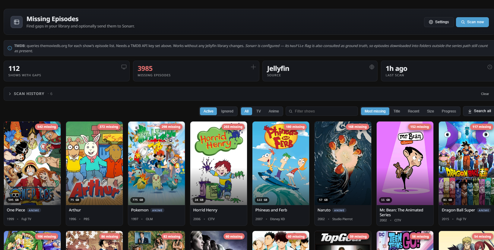

# Missing Episodes for Jellyfin

A Jellyfin plugin that finds the gaps in your TV library and — if you want — fires them off to Sonarr.

Scans your **Jellyfin library**, your **Sonarr instance**, or looks things up on **TMDB** when neither has the data. Shows you exactly what's missing per show, per season, per episode, with thumbnails, air dates, storage sizes, and a one-click search button that hands off to Sonarr.

> **Status: stable (1.0.x).** Works end-to-end on Jellyfin 10.11.8 + Sonarr v3. Install via manifest URL or manual DLL drop — see below. Issues & PRs at <https://github.com/ZL154/MissingEpisodesJellyfin>.

## Features

- **Three ways to find missing episodes**
  - **Sonarr** — trust Sonarr's `monitored` + `hasFile` flags. Fast, authoritative, works out of the box.
  - **Jellyfin / Virtual items** — use Jellyfin's own missing-episode items (requires *Display missing episodes within seasons* in the library settings).
  - **Jellyfin / TMDB** — query [The Movie Database](https://www.themoviedb.org/) for each show's canonical episode list. Works without any Jellyfin library reconfiguration. Needs a free TMDB API key.
  - **Jellyfin / Gap detection** — find numbering holes (E01, E02, _E03 missing_, E04) in the episodes that *are* on disk. No external dependencies, limited but useful.
- **Send to Sonarr with one click** — per episode, per season, per show, or everything visible at once.
- **Auto-search** (optional) — runs the scan on a schedule and dispatches every missing episode to Sonarr without human intervention.
- **Active / Ignored tabs** — hide shows you never care about (defunct series, one-off specials) so the list stays focused.
- **Filters** — All / TV / Anime, plus title search. Anime detection uses Sonarr's series type or Jellyfin genres/tags.
- **Persistent results + scan history** — the last scan survives Jellyfin restarts; a rolling log of the most recent 25 scans is kept for context (timestamp, source, missing count, duration).
- **Live progress** — the scan runs server-side and shows live progress (X / Y series, current show, percentage). Leave the page, come back, and the UI picks up where it left off. A toast fires in the Jellyfin web client when the scan finishes.
- **Sidebar entry** — shows up as *Missing Episodes* in the Jellyfin admin sidebar, not buried in the Plugins page.
- **Storage + path info** — each show card shows a GB chip (size on disk); the detail view shows the series path. Size is summed from Jellyfin's on-disk folder in Jellyfin modes, or from Sonarr's statistics in Sonarr mode. When both are available, the plugin prefers whichever one actually has content (so a stale Jellyfin path after a move doesn't win).
- **Rescan this show** — button in the detail view that pulls only the current show (not the whole library). Uses Sonarr's tvdbId-indexed endpoint in Sonarr mode; runs just the single-series Jellyfin loop in Jellyfin mode.
- **Sort by Size / Progress** — alongside the default Most missing / Title / Recent. "Progress" surfaces your least-complete shows first.
- **Scan history with a Clear button** — rolling 25 scans log. Wipe it anytime.
- **Admin-only API** — every endpoint requires the `RequiresElevation` policy.

## Screenshots

Drop screenshots into `docs/screenshots/` and reference them here — for example:

```



```

(Screenshot files not committed — add your own.)

## Install

### Option 1 — Jellyfin plugin repository (recommended)

1. Jellyfin **Dashboard** → **Plugins** → **Repositories** → **➕**
2. Name: `Missing Episodes`
3. URL: `https://raw.githubusercontent.com/ZL154/MissingEpisodesJellyfin/main/manifest.json`
4. **Save** → **Catalog** → find *Missing Episodes* → **Install**.
5. Restart Jellyfin.

### Option 2 — Manual install

1. Download the `.zip` from the latest [release](https://github.com/ZL154/MissingEpisodesJellyfin/releases).
2. Unzip the DLL into your Jellyfin plugin directory:
   - Docker: `/config/plugins/MissingEpisodes_x.y.z.w/`
   - Linux package: `/var/lib/jellyfin/plugins/MissingEpisodes_x.y.z.w/`
   - Windows: `%ProgramData%\Jellyfin\Server\plugins\MissingEpisodes_x.y.z.w\`
3. Restart Jellyfin.

## Configuration

1. **Dashboard → Missing Episodes** (or the sidebar entry) → **Settings**.
2. Paste your **Sonarr URL** (e.g. `http://sonarr.local:8989`) and **API key** (Sonarr → Settings → General). Click **Test Sonarr**.
3. (Optional) Paste a **TMDB API key** (get one free at <https://www.themoviedb.org/settings/api>). Click **Test TMDB**.
4. Pick a **Scan source**:
   - **Sonarr** — best if Sonarr already knows about all your shows.
   - **Jellyfin** — picks a method: *Virtual items* / *TMDB* / *Gap detection*.
5. Toggle **Only monitored**, **Ignore specials**, **Ignore unaired** as you like.
6. (Optional) Enable **Auto-send missing episodes to Sonarr** + an interval.
7. **Save**, then **Scan now**.

## How it decides what's missing

### Sonarr source

- Pulls every series from `/api/v3/series` and every episode from `/api/v3/episode?seriesId={id}&includeImages=true`.
- Flags episodes where `hasFile == false`, honoring your `OnlyMonitored` / `IgnoreSpecials` / `IgnoreUnaired` toggles.
- Thumbnails come from Sonarr's `screenshot` images.
- Series metadata (network, status, year, poster, size, path) also comes from Sonarr.

### Jellyfin source — Virtual items

- Enumerates the Jellyfin library for items where `IsVirtualItem == true`.
- These only exist when *Display missing episodes within seasons* is enabled on the library and a metadata scan has run.
- Best fidelity — full titles, air dates, Jellyfin-tagged artwork.

### Jellyfin source — TMDB

- For each Jellyfin series with a TMDB id, fetches `GET /3/tv/{id}` + `GET /3/tv/{id}/season/{n}`.
- Diffs the canonical TMDB episode list against the episodes actually on disk in Jellyfin.
- Catches whole missing seasons and trailing episodes that gap detection can't.
- Requires a (free) TMDB API key.

### Jellyfin source — Gap detection

- For each season in your library, finds `{1..max}` that isn't in the on-disk set.
- No external dependencies. Can't detect missing final episodes or missing seasons — only holes.

### Enrichment

If Sonarr is configured AND you're running a Jellyfin-source scan, the plugin will **additionally** match shows to Sonarr series (by TVDB or TMDB id) and stamp them with the Sonarr episode IDs. That's what makes the **Search** buttons work in any mode.

## Sending to Sonarr

- **Per-episode search** — inline button on each missing episode row.
- **Per-season search** — header button on each season in the detail view.
- **Search all missing (one show)** — bottom of the detail view.
- **Search all (across current filter)** — toolbar button on the grid. Respects the type / ignored / text filters.
- **Auto-search** — a background worker runs at the configured interval, does a full scan, and dispatches all missing episodes.

Every path hits `POST /api/v3/command` on Sonarr with a batched `EpisodeSearch` command.

## Data this plugin stores

All under the plugin's data folder (`/config/plugins/Jellyfin.Plugin.MissingEpisodes/`):

| File | Purpose | Size |
| ---- | ------- | ---- |
| `last-result.json` | Full result of the most recent scan. Loaded lazily on first request after restart. | Up to a few MB on large libraries. |
| `history.json` | Rolling log of the last 25 scans (timestamps, totals, duration). | Small. |

Plugin configuration (URLs, API keys, toggles) lives in Jellyfin's own plugin config XML, not here.

**Deleting a scan**: stop Jellyfin, delete either file, restart. Next scan regenerates them.

## Building from source

Requires the .NET 9 SDK.

```bash
git clone https://github.com/ZL154/MissingEpisodesJellyfin.git
cd MissingEpisodesJellyfin/Jellyfin.Plugin.MissingEpisodes
dotnet build -c Release
```

DLL lands in `bin/Release/net9.0/Jellyfin.Plugin.MissingEpisodes.dll`.

## Troubleshooting

**"No scan yet" after a scan completed.**
The scan runs on a background task; a completion toast fires in the Jellyfin client. If the UI still shows "No scan yet", hard-refresh. Results persist to disk so a browser refresh or Jellyfin restart shouldn't lose them.

**Search buttons are greyed out.**
Either Sonarr isn't configured or the selected shows have no Sonarr id yet. In Jellyfin-source mode the plugin enriches results with Sonarr IDs only if you've set a URL + API key. Switch to Sonarr-source mode to see all search buttons, or configure Sonarr and rescan.

**Jellyfin-source / Virtual items returns 0 missing.**
*Display missing episodes within seasons* isn't enabled, or the library scan hasn't created virtual items yet. Enable the option in **Dashboard → Libraries → (library)**, run **Scan Media Library**, then rescan in the plugin. Or switch to **TMDB** mode — same data without the Jellyfin library toggle.

**No size chip on show cards.**
Sizes only populate when Sonarr has the show. In Jellyfin-only modes the plugin backfills from Sonarr during enrichment — so Sonarr must be configured for the chip to appear.

**Settings don't seem to save.**
The Jellyfin/Sonarr/TMDB segment controls auto-save on click. Scan source also auto-saves. The free-form fields (URL, API key, interval, checkboxes) need **Save**. Reload the page to verify.

**"An error occurred while getting the plugin details from the repository." on the Plugins page.**
Harmless. This happens when the plugin was installed manually (DLL dropped into the plugins folder) — Jellyfin can't look it up in any of your configured plugin repositories, so it shows this warning on the details view. The plugin itself runs fine. To silence it, add the manifest URL (`https://raw.githubusercontent.com/ZL154/MissingEpisodesJellyfin/main/manifest.json`) in **Dashboard → Plugins → Repositories**, then uninstall the plugin and reinstall it from the catalog.

**Rescan finished but the missing count didn't change.**
Rescan re-reads the show's data from Sonarr or TMDB — it doesn't wait for Sonarr to actually download anything. If you just kicked off the Search and immediately rescanned, the count won't drop until Sonarr grabs a release and Jellyfin picks it up. Give Sonarr a minute, then rescan again.

## License

MIT — see [LICENSE](LICENSE).

## Not affiliated with

Jellyfin, Sonarr, TMDB, or anyone else. Third-party plugin.
